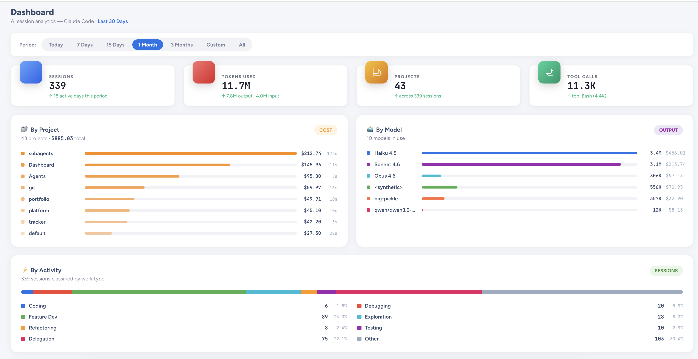
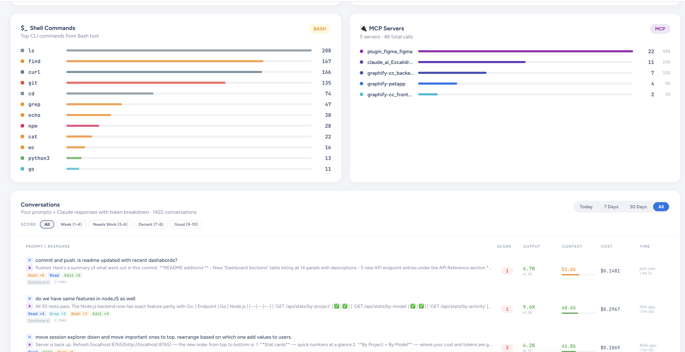

# AI Usage Dashboard (`ai-sessions`)

> **Understand how you use Claude — cost, productivity, work patterns, and prompt quality, all in one place.**

`ai-sessions` is a local-first analytics dashboard that reads your Claude Code session history from `~/.claude/projects/` and turns it into actionable insights. No cloud. No account. No data leaves your machine.

---

## Why this exists

Every Claude Code session generates rich data — tokens used, tools called, prompts written, costs incurred. That data sits in JSONL files on your disk and is never surfaced anywhere. `ai-sessions` reads those files and answers the questions developers actually care about:

- **Where is my AI spend going?** See cost broken down by project and model.
- **What type of work am I delegating to Claude?** Coding, debugging, exploration, feature dev — classified automatically.
- **Am I writing good prompts?** The CARE framework (Context, Ask, Rules, Examples) scores every prompt 1–10 and tells you how to improve.
- **Which tools and shell commands does Claude use on my behalf?** Top tools, Bash commands, and MCP server calls, all ranked.
- **How productive am I across sessions?** Token efficiency, output ratio, hourly patterns, cache hit rate.

---

## Screenshots

### Dashboard overview — stat cards and token usage trend


Quick numbers at a glance: total sessions, tokens used, active projects, tool calls. The token chart shows daily input/output over your selected date range with 70/300/900/ALL range presets.

---

### Cost and work breakdown — By Project, By Model, By Activity


See exactly where your AI budget is going. **By Project** ranks directories by cost. **By Model** shows which Claude models (Haiku, Sonnet, Opus) you actually use. **By Activity** classifies every session into a work type — Coding, Debugging, Feature Dev, Exploration, Refactoring, Testing, Delegation — using keyword analysis on first prompts.

---

### Shell commands and MCP server usage


**Shell Commands** extracts the first word of every Bash tool call across all sessions and ranks the most-used CLI tools. **MCP Servers** groups tool calls by server name from `mcp__server__tool` keys, so you can see which integrations (Figma, context7, filesystem, etc.) are doing real work.

The **Conversations** panel below shows every user→assistant exchange with token counts, context usage, cost per turn, and CARE prompt scores.

---

### Session Explorer and Prompt Insights


Browse all sessions across all projects in one table — filter by source (Claude, Cursor, Copilot), search by prompt or project, and click any row to open the detail drawer. **Prompt Insights** on the right shows your CARE score distribution, tier badge (Beginner → Expert), and per-dimension feedback.

---

### Tool usage and hourly activity


**Tool Usage** ranks every tool by total calls with clickable drill-down into sample inputs. An anti-pattern warning fires when Bash:Grep ratio exceeds 1.3× (using shell `rg` instead of the Grep tool wastes ~18% tokens). **Hourly Activity** shows your peak coding hours across a 24-hour bar chart.

---

### Context health and Claude Code config


**Context Health** shows context window fill % per recent session — useful for spotting sessions that are growing too long. **Claude Code Config** surfaces your total message count, enabled plugins, connected MCP servers, session files, plans, and file history — all read from your local `~/.claude` folder.

---

### Session detail drawer


Click any session to open a full detail drawer: turn count, cache read/write, estimated cost, slowest and average turn durations, output tokens. Tabs for Timeline (turn-by-turn breakdown), Files (touched during the session), and Subagents spawned.

---

## Quick Start

### Prerequisites

- **Node.js 16+** (required for both backends and the web UI)
- **Go 1.18+** (only if using the Go backend)

### Step 1 — Choose your backend

Create `backend.config.json` in the project root:

**Option A: Node.js backend** (recommended for most users)
```bash
echo '{ "backend": "nodejs" }' > backend.config.json
```

**Option B: Go backend** (lower memory, faster startup, requires Go installed)
```bash
echo '{ "backend": "go" }' > backend.config.json
```

| | Go | Node.js |
|---|---|---|
| Requires | Go 1.18+ | Node.js 16+ only |
| Startup | Fast | Moderate |
| Memory | Low (~10 MB) | Moderate |
| Recommended for | Power users / CI | Most users |

### Step 2 — Install and start

```bash
npm run setup   # installs chosen backend + builds the React UI
npm start       # starts the backend server
```

Open your browser to `http://localhost:8765`

### Switching backends later

Edit `backend.config.json`, then re-run:

```bash
npm run setup
npm start
```

See [Backend Selection Guide](./docs/BACKEND_SELECTION.md) for full comparison and troubleshooting.

---

## Dashboard Sections

| Section | What it shows |
|---|---|
| **Stat Cards** | Sessions, tokens, projects, tool calls at a glance |
| **By Project** | Cost and session count per project directory |
| **By Model** | Output tokens and cost per Claude model (Haiku, Sonnet, Opus) |
| **By Activity** | Sessions classified by work type — Coding, Debugging, Feature Dev, Exploration, Refactoring, Testing, Delegation |
| **Token Chart** | Daily input/output token usage over the selected date range |
| **Tool Usage** | Top tools with clickable drill-down into sample inputs |
| **Hourly Activity** | When you're most productive (24-hour bar chart) |
| **Shell Commands** | Top CLI commands extracted from Bash tool calls |
| **MCP Servers** | Tool call counts grouped by MCP server name |
| **Conversations** | Recent user→assistant pairs with CARE prompt scores, token counts, and cost per turn |
| **Context Health** | Context window fill % per recent session |
| **Tasks** | Aggregated task status across all projects |
| **Session Explorer** | Paginated session table with source filter and detail drawer |
| **Prompt Insights** | CARE score distribution, tier badge, per-dimension analysis, next-tier goals |

All sections respond to the global date filter (Today / 7 Days / 1 Month / Custom / All).

---

## Tech stack

- **Backend (Go):** `net/http`, `embed`, `gorilla/websocket`, `fsnotify`
- **Backend (Node.js):** Express, TypeScript, `ws`, `chokidar`
- **Frontend:** React 18, React Router, Vite, Chart.js

## Architecture overview

The dashboard follows a **single-binary, layered architecture**:

1. **Adapter layer** — Multi-source session parsers (Claude Code, Copilot, Cursor, Windsurf)
2. **Store layer** — In-memory indexed session store with aggregation
3. **API layer** — REST endpoints with pagination and filtering
4. **WebSocket layer** — Real-time updates via hub broadcast
5. **UI layer** — React SPA consuming REST + WebSocket

For a detailed breakdown, see [System Design Overview](wiki/Dev-System-Design-Overview.md) in the wiki.

---

## Local Development

### Frontend dev server
```bash
cd web
npm install
npm run dev
```

### Backend server (separate terminal)
```bash
go run .
```

Frontend proxy (Vite) forwards `/api` and `/ws` to `http://localhost:8765`.

See [Local Development Setup](wiki/Dev-Local-Development-Setup.md) for full details.

---

## API Reference

Base URL: `http://localhost:8765`

**Health & Stats**
- `GET /api/health` — Service health probe
- `GET /api/stats?days=N` — Aggregate stats for relative date range
- `GET /api/stats?from=YYYY-MM-DD&to=YYYY-MM-DD` — Aggregate stats for explicit date range
- `GET /api/stats/by-project?days=N` — Cost + session count per project directory
- `GET /api/stats/by-model?days=N` — Output tokens + cost per Claude model
- `GET /api/stats/by-activity?days=N` — Session counts classified by work type
- `GET /api/shell-commands?days=N` — Top CLI commands from Bash tool samples
- `GET /api/mcp-servers?days=N` — Tool call counts grouped by MCP server name

**Sessions**
- `GET /api/sessions?page=1&limit=20&project=<substring>` — Paged session list with optional project filter
- `GET /api/sessions/:id/turns` — Session metadata + parsed turn details

**Conversations & Scoring**
- `GET /api/conversations?period=today|week|month|all&limit=N&page=P&score_min=1&score_max=10` — User→assistant pairs with CARE scores

**Insights & Analysis**
- `GET /api/insights?days=N&refresh=1` — Prompt quality tier, per-dimension analysis, next-tier goals, peer benchmarks

**Tools & System**
- `GET /api/tools/:name/samples` — Tool usage samples with project and timestamp
- `GET /api/system` — Claude environment metadata, enabled plugins, MCP servers, model usage
- `GET /api/tasks` — Aggregated task status across all projects
- `GET /api/history?days=N&limit=N` — Recent entries from `~/.claude/history.jsonl`
- `GET /api/image?path=<absolute-path>` — Image files under `~/.claude/image-cache`

## WebSocket Events

Endpoint: `/ws`

- `session_updated` — Broadcast when a session file changes
  - Payload: `{ session_id, input_tokens, project_dir }`

---

## Contributing

Found a bug or want to add a feature? Check out the [Contributing Guide](wiki/Dev-PR-Process.md) in the wiki.

The project is organized into:
- **Go backend** (`internal/`, `main.go`) — Adapters, store, API handlers, WebSocket
- **Node.js backend** (`backends/nodejs/src/`) — TypeScript port of the Go backend
- **React frontend** (`web/src/`) — Dashboard UI, pages, components, hooks

See [Developer Quick Start](wiki/Dev-Getting-Started-Quick-Start.md) to get set up for contributing.

---

## Notes

- **Local-first:** Reads only from your local `~/.claude` folder. Nothing is sent anywhere.
- **Session scoring:** The CARE framework (Context, Ask, Rules, Examples) is computed server-side per conversation. Scores cap at 7 for prompts missing structural components, encouraging deliberate prompt craft.
- **Multi-source:** Supports Claude Code, GitHub Copilot, Cursor, Windsurf, and OpenCode via the adapter interface.
- **Live updates:** A file watcher pushes session changes over WebSocket so the dashboard updates in near real-time as Claude works.
