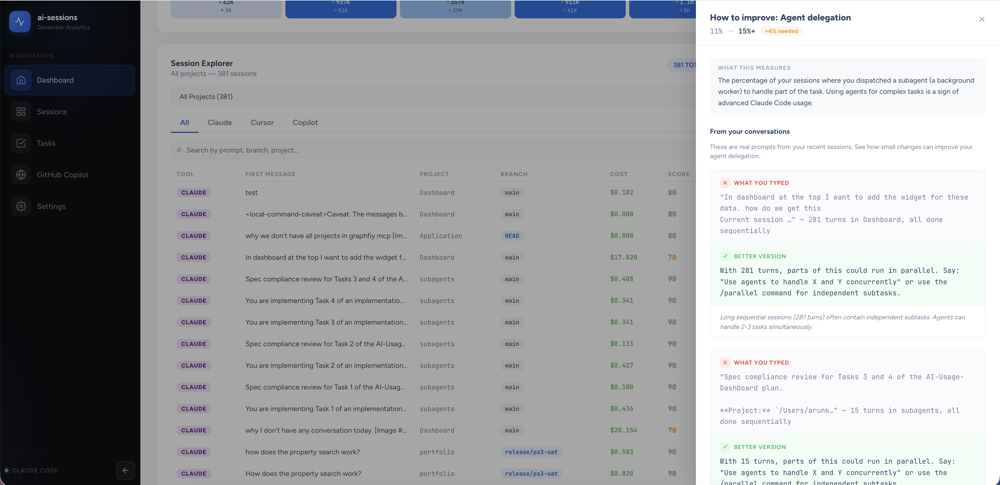
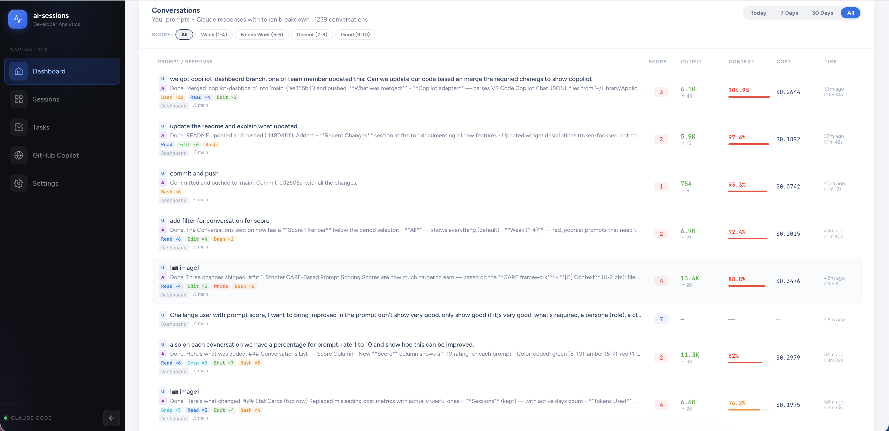

# AI Usage Dashboard (`ai-sessions`)
`ai-sessions` is a local-first analytics dashboard for Claude Code session activity.

It parses Claude session JSONL files from `~/.claude/projects/`, computes usage/cost/productivity metrics, and serves a React dashboard with live updates over WebSocket.

## Recent Changes (April 2026)

### CARE-Based Prompt Scoring
Every conversation is now scored 1-10 using the **CARE framework**:
- **[C] Context** (0-2 pts): Does the prompt set context? File paths, function names, role/persona.
- **[A] Ask** (0-3 pts): Clear action verb, detailed instruction, structured multi-step request.
- **[R] Rules** (0-2 pts): Constraints, boundaries, expected behavior, acceptance criteria.
- **[E] Examples** (0-2 pts): Desired output format, code examples, before/after patterns.

Score labels are strict: **1-4 Weak**, **5-6 Needs Work**, **7-8 Decent**, **9-10 Good**. Only truly structured prompts earn "Good". Each conversation in the detail panel shows the score ring and actionable tips tagged by which CARE dimension is missing.

### Conversations Score Filter
Filter conversations by score range to find your weakest prompts and learn from them. Server-side filtering with pagination.

### Beginner-Friendly Tooltips
Every metric in the PromptScore widget (Output ratio, Agent delegation, Prompt specificity, Tool breadth) now has a `?` tooltip explaining what it means in plain language — designed for users who are new to Claude Code.

### Real Conversation Examples in "Path to Next Tier"
Each unmet goal now has an `examples →` link that opens a slide-over panel showing actual prompts from your sessions with:
- What you typed (highlighted as bad)
- A better version with explanation
- Why the change helps

Examples are dynamically generated from your real session data.

### Token-Focused Dashboard
Removed misleading cost metrics (which used API pricing, not subscription billing). The dashboard now focuses on **tokens**:
- Stat cards: Sessions, Tokens Used, Projects, Tool Calls
- Token chart: area chart with output/input lines, output ratio, cache hit rate
- 7-day heatmap: input/output token breakdown per day with color-coded intensity
- Cost view removed from chart toggle

### Layout Improvements
- Conversations widget moved to full width for better readability
- Tasks widget moved to bottom row alongside Context Health and System Info (3-column grid)
- Session Explorer shows 15 rows per page (up from 10)

## What it does
- Loads historical Claude Code sessions into an in-memory store.
- Aggregates token, cost, tool, project, and daily activity metrics.
- Streams near-real-time updates when session files change.
- Exposes REST APIs for dashboard data and detailed drill-down views.
- Serves a React + Vite UI from the same Go binary.

## Who this helps
This dashboard is useful for:
- **Individual developers** who want to understand AI usage, token consumption, and productivity over time.
- **Power users of Claude Code** who want to improve prompt quality using the CARE scoring framework.
- **Tech leads / engineering managers** who need visibility into usage patterns, project focus, and productivity windows.
- **Beginners / freshers** who want to learn how to write better prompts with real examples and actionable tips.

## Widget ideas this dashboard gives you
If you are building your own analytics UI, this project shows practical widget patterns you can reuse:
- **KPI cards**: sessions, tokens used, active projects, tool calls.
- **Token trend chart**: area chart with output/input lines, cache view, output ratio and cache hit rate metrics.
- **Session explorer table**: searchable session list (15 rows) plus detail drawer.
- **Tool usage panel**: top tools with clickable sample drill-down.
- **Hourly activity chart**: peak coding/agent activity by hour.
- **Conversation table with prompt scoring**: each prompt rated 1-10 using CARE framework, filterable by score range.
- **Context health panel**: context-window fill tracking with warning states.
- **Prompt insights card (PromptScore)**: tier system with beginner-friendly tooltips, "Path to Next Tier" with real conversation examples, peer benchmarks.
- **Live update banner**: real-time feedback when new session data arrives.
- **7-day token heatmap**: daily input/output token breakdown with color-coded intensity tiles.

## Quick Tour
- [Dashboard overview](#1-dashboard-overview) — KPI cards, token trend chart, 7-day heatmap
- [Session Explorer + Prompt Insights](#2-session-explorer--prompt-insights) — Sessions with PromptScore, tooltips, and tier roadmap
- [Prompt Examples Panel](#3-prompt-examples-panel) — Real conversation examples with improvement suggestions
- [Conversations with CARE Scoring](#4-conversations-with-care-scoring) — Every prompt scored 1-10, filterable by quality
- [Conversation Detail + Prompt Quality](#5-conversation-detail--prompt-quality) — Deep dive with CARE score ring and actionable tips
- [Context Health + System Info + Tasks](#6-context-health--system-info--tasks) — Context tracking, config overview, task progress

## Dashboard screenshots (with explanation)
### 1) Dashboard overview
KPI cards show **Sessions**, **Tokens Used** (with input/output breakdown), **Projects**, and **Tool Calls** — focused on actual usage, not misleading cost estimates. The token trend area chart shows output (green) vs input (purple) over time with date range toggles. Below, a **7-day heatmap** shows daily input/output token volume with color-coded intensity tiles.


### 2) Session Explorer + Prompt Insights
The session table (15 rows per page) shows all sessions with source badges (Claude, Copilot), project, branch, and quality score. On the right, the **PromptScore** card shows your tier (Beginner → Expert) with beginner-friendly `?` tooltips explaining each metric. The **"Path to Next Tier"** section shows exactly what to improve, with clickable `examples →` links for each dimension.


### 3) Prompt Examples Panel
Clicking `examples →` opens a slide-over panel showing **real prompts from your conversations**. Each example shows what you typed (red), a better version (green), and why the change helps. Examples are dynamically generated from your actual session data — not hardcoded. This teaches you how to write better prompts by learning from your own usage patterns.


### 4) Conversations with CARE Scoring
Every conversation is scored **1-10** using the **CARE framework**: **C**ontext (file paths, role), **A**sk (action verb, detail), **R**ules (constraints, boundaries), **E**xamples (output format, code samples). Filter by score range to find your weakest prompts and learn from them. The Score column is color-coded: red (1-4 Weak), amber (5-6 Needs Work), blue (7-8 Decent), green (9-10 Good).


### 5) Conversation Detail + Prompt Quality
The detail panel shows a **Prompt Quality ring** (1-10) with improvement tips tagged by CARE dimension (`[C]`, `[A]`, `[R]`, `[E]`). Below, the token usage breakdown shows what you paid for: Your Prompt, Claude Response, Context Loaded (cached), and Context Saved. The full user input and Claude response are displayed with tool call details.


### 6) Context Health + System Info + Tasks
Three widgets in the bottom row: **Context Health** tracks context window fill per session with warning states. **System Info** shows Claude Code config (plugins, MCP servers, session stats). **Tasks** shows completion progress across projects with a ring chart and in-progress items.


## Tech stack
- Backend: Go (`net/http`, `embed`)
- Realtime: `gorilla/websocket`
- File watching: `fsnotify`
- Frontend: React 18, React Router, Vite
- Charts: Chart.js

## Architecture overview
This project follows a **single-binary, layered architecture**:

1. **Adapter layer** (`internal/adapters/*`)
   - Detects and parses source session files.
   - Implementations: Claude Code adapter, GitHub Copilot adapter.
2. **Store layer** (`internal/store`)
   - In-memory indexed session store.
   - Computes aggregate statistics and time-windowed summaries.
3. **API layer** (`internal/api`)
   - HTTP handlers for stats, sessions, system, and conversation APIs.
4. **Realtime layer** (`internal/ws`, `internal/watcher`)
   - Filesystem watcher detects `.jsonl` changes.
   - WebSocket hub broadcasts update events to connected clients.
5. **UI layer** (`web/src`)
   - React SPA consuming REST + WebSocket.
   - Build output embedded into Go binary and served as static assets.

## Runtime flow
### Startup
1. `main.go` creates:
   - Claude adapter
   - in-memory store
   - WebSocket hub
2. Store performs initial full load (`LoadAll`) from `~/.claude/projects/`.
3. Watcher starts recursive file monitoring on the same directory.
4. API routes and `/ws` endpoint are registered.
5. Embedded `web/dist` is served at `/`.

### Live updates
1. Claude writes/updates a session `.jsonl`.
2. `internal/watcher` receives fsnotify event.
3. Updated file is reparsed through adapter.
4. Store upserts session.
5. Hub broadcasts a `session_updated` event.
6. Frontend hook (`useWebSocket`) refreshes stats/sessions in UI.

## Component responsibilities
### Backend
- `main.go`
  - Dependency wiring, startup load, watcher startup, route registration, embedded static serving.
- `internal/adapters/adapter.go`
  - Adapter abstraction for multi-source support.
- `internal/adapters/claudecode/adapter.go`
  - Session discovery and parsing logic for Claude JSONL files.
  - Extracts turns, token usage, tool calls, timing, metadata.
- `internal/store/store.go`
  - Thread-safe in-memory session map.
  - Aggregation logic: totals, daily metrics, cost estimation, active session detection.
- `internal/api/handlers.go`
  - REST endpoints and response shaping.
  - Adds pagination/filtering and detailed views (session turns, tool samples, conversations).
- `internal/ws/hub.go`
  - WebSocket client registry and fan-out broadcast.
- `internal/watcher/watcher.go`
  - Recursive watch registration + update event handling.
- `internal/models/models.go`
  - Core DTO/domain structs for parser, store, API, and frontend payload contracts.

### Frontend
- `web/src/App.jsx`
  - Layout + route shell.
- `web/src/pages/Dashboard.jsx`
  - Main analytics page with metrics, charts, and live updates.
- `web/src/pages/Sessions.jsx`
  - Session explorer.
- `web/src/pages/Settings.jsx`
  - Adapter configuration/status surface.
- `web/src/hooks/useWebSocket.js`
  - Connection/reconnect logic for `/ws` updates.
- `web/src/components/*`
  - Presentation cards, charts, tables, and drill-down UI.

## Data model highlights
- `Session`: parsed unit from one JSONL file (tokens, turns, tool usage, timing, project path, model).
- `Stats`: aggregated metrics for selected date windows and totals.
- `ConversationPair`: user→assistant paired turns with prompt scoring, improvement tips, token/context calculations.
- `TierGoal`: per-dimension gap analysis with real prompt examples from user conversations.
- `PromptExample`: actual bad prompt from sessions paired with a better version and explanation.
- `SystemInfo`: metadata pulled from Claude local config/cache folders.

## API reference
Base URL: `http://localhost:8765`

- `GET /api/health`
  - Service health probe.
- `GET /api/stats?days=N`
  - Aggregate stats for relative date range.
- `GET /api/stats?from=YYYY-MM-DD&to=YYYY-MM-DD`
  - Aggregate stats for explicit date range.
- `GET /api/sessions?page=1&limit=20&project=<substring>`
  - Paged session list with optional project filter.
- `GET /api/sessions/:id/turns`
  - Session metadata + parsed turn details.
- `GET /api/tools/:name/samples`
  - Tool usage samples across sessions.
- `GET /api/history?days=N&limit=N`
  - Recent entries from `~/.claude/history.jsonl`.
- `GET /api/system`
  - Local Claude environment metadata and usage summary.
- `GET /api/conversations?period=today|week|month|all&limit=N&page=P&score_min=1&score_max=10`
  - User→assistant conversation pairs with CARE prompt scoring. Filter by score range.
- `GET /api/insights?days=N&refresh=1`
  - Prompt quality insights: tier, dimensions, next-tier goals with real prompt examples, peer benchmarks, Haiku AI analysis.
- `GET /api/tasks`
  - Aggregated task status from `~/.claude/todos/` across all projects.
- `GET /api/image?path=<absolute-path>`
  - Serves image files under `~/.claude/image-cache` only.

## WebSocket events
Endpoint: `/ws`

Current event type:
- `session_updated`
  - Payload includes:
    - `session_id`
    - `input_tokens`
    - `project_dir`

## Project structure
```text
.
├── main.go
├── internal/
│   ├── adapters/
│   │   ├── adapter.go
│   │   └── claudecode/adapter.go
│   ├── api/handlers.go
│   ├── models/models.go
│   ├── store/store.go
│   ├── watcher/watcher.go
│   └── ws/hub.go
├── web/
│   ├── package.json
│   ├── vite.config.js
│   ├── src/
│   │   ├── App.jsx
│   │   ├── hooks/useWebSocket.js
│   │   ├── pages/
│   │   └── components/
│   └── dist/
└── Makefile
```

## Prerequisites
- Go (version compatible with `go.mod`)
- Node.js + npm (for frontend build/dev)
- Claude local data directory available at `~/.claude`

## Local development
### 1) Frontend dev server
```bash
cd web
npm install
npm run dev
```

### 2) Backend server (separate terminal)
```bash
go run .
```

Frontend proxy (Vite) forwards:
- `/api` → `http://localhost:8765`
- `/ws` → `ws://localhost:8765`

## Production-style local run
Build frontend + backend binary:
```bash
make build
```

Run:
```bash
./ai-sessions
```

Default URL: `http://localhost:8765`  
Change port with:
```bash
PORT=9000 ./ai-sessions
```

## Testing
Run all Go tests:
```bash
make test
```
or
```bash
go test ./...
```

## Notes
- This app is local-first and reads from your local Claude data folders.
- Token metrics are derived from session JSONL files. The dashboard focuses on token consumption rather than cost, since most users are on subscription plans where API-equivalent cost is not meaningful.
- Prompt scoring uses the CARE framework (Context, Ask, Rules, Examples) computed server-side per conversation pair. Scores are intentionally strict to challenge users to improve.
- Adapter interface is designed for future sources (Cursor/Copilot/Windsurf stubs already reflected in UI).
